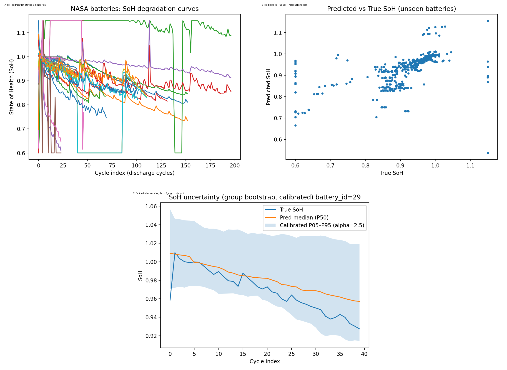

# EV Battery State-of-Health (SoH) Estimation (NASA) — CPU + Uncertainty

This project estimates Li-ion battery State-of-Health (SoH) from a cleaned NASA battery dataset using a leakage-safe ML workflow (grouped by battery_id). It also produces calibrated uncertainty intervals using a group-bootstrapped ensemble.

## Highlights
- Robust SoH definition using baseline capacity = median of first 5 discharge cycles
- Leakage-safe evaluation with GroupKFold (grouped by battery_id)
- XGBoost model with monotonic constraint on cycle index
- Uncertainty: group-bootstrap + post-hoc calibration to target empirical coverage

## Project structure
- `src/data/` data processing + plotting
- `src/models/` training, CV, uncertainty, calibration
- `docs/` design doc
- `run_all.bat` one-command pipeline runner (Windows)

## Setup (Windows / Conda)
```bat
conda create -n batterysoh python=3.11 -y
conda activate batterysoh
pip install -U pip
pip install numpy pandas pyarrow scipy scikit-learn matplotlib tqdm xgboost joblib pillow

## Key results 
- GroupKFold CV(5-Fold, grouped by battery_id): MAE~ 0.09, RMSE~0.12
-Uncertainty(group-bootstrap):
   - Base interval coverage ~ 0.67
   - Calibrated interval coverage ~ 0.80 (alpha~ 2.5)

## Plots / Demo


## Method (high level)
1) Filter discharge cycles and remove invalid capacities.
2) Define baseline capacity per battery as the median of the first 5 discharge cycles.
3) Compute SoH = Capacity / BaselineCapacity and keep SoH within [0.60, 1.15] for modeling.
4) Train XGBoost with a monotonic constraint on cycle index (SoH should not increase with aging).
5) Evaluate with GroupKFold grouped by battery_id to prevent leakage.
6) Estimate uncertainty with a group-bootstrapped ensemble and calibrate interval width to target coverage.

## Reproducibility
- Full pipeline: `run_all.bat`
- Key outputs are written to `reports/` (ignored by git)
- Data is not included; place the CSV in `data/raw/` (see `data/README.md`)

## Key engineering decisions
- Robust baseline capacity (median of first 5 cycles) to avoid abnormal early-cycle artifacts.
- Grouped splitting by battery_id to prevent leakage.
- Monotonic constraint on cycle index to encode domain knowledge.
- Interval calibration because raw bootstrap intervals under-covered under battery-to-battery shift.

## Limitations and next steps
- Current features are limited (Re/Rct/temp + cycle index). Next step: extract features from per-cycle voltage/current curves.
- Investigate domain shift by temperature / protocol and add drift monitoring.
- Add a lightweight FastAPI endpoint + Streamlit dashboard for interactive inference.